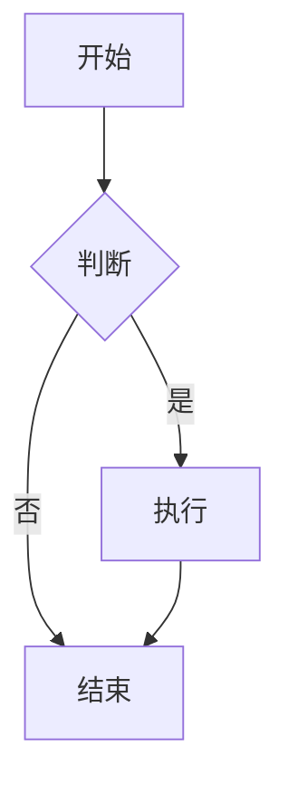

# Obsidian Markdown 使用教程

## 概述

Markdown 是一种轻量级标记语言，专为简单易读易写的纯文本格式设计。在 Obsidian 中，Markdown 是创建和组织知识的核心工具。本教程将介绍 Markdown 基础语法和 Obsidian 特有功能。

## Markdown 基础语法

### 1. 标题

使用 `#` 符号创建标题，`#` 的数量表示标题级别（1-6 级）：

```
# 一级标题
## 二级标题
### 三级标题
#### 四级标题
##### 五级标题
###### 六级标题
```

### 2. 段落和换行

- 段落：用空行分隔
- 换行：在行尾添加两个空格，然后回车

### 3. 文本样式

```
**粗体文本** 或 __粗体文本__
*斜体文本* 或 _斜体文本_
***粗斜体文本***
~~删除线文本~~
==高亮文本==
```

### 4. 列表

#### 无序列表

使用 `-`、`*` 或 `+`：

```
- 项目一
- 项目二  
 - 子项目
 - 子项目
```

#### 有序列表

使用数字加点号：

```
1. 第一项
2. 第二项   
    1. 子项一   
    2. 子项二
```

#### 任务列表

```
- [ ] 待办任务
- [x] 已完成任务
```

### 5. 链接和图片

#### 外部链接

```
[链接文本](https://example.com)
[带标题的链接](https://example.com "标题")
```

#### 图片

```


```

### 6. 引用

使用 `>` 创建引用：

```
> 这是一个引用>
> 
> 可以多行
>> 嵌套引用
```

### 7. 代码

#### 行内代码

使用反引号 \`：

```
使用 \`print("Hello")\` 函数
```

#### 代码块

使用三个反引号，可指定语言：

````md
```python
def hello():
    print("Hello World")
```

````

### 8. 分隔线

使用三个或更多 `-`、`*` 或 `_`：

```md

---
***
___

```

### 9. 表格

```

| 标题 1 | 标题 2 | 标题 3 |
|-------|-------|-------|
| 内容 1 | 内容 2 | 内容 3 |
| 内容 4 | 内容 5 | 内容 6 |

```

对齐方式：

```md
| 左对齐 | 居中对齐 | 右对齐 |
|:-------|:--------:|-------:|
| 单元格 | 单元格   | 单元格 |
```

## Obsidian 特有功能

### 1. 内部链接（WikiLinks）

Obsidian 使用双括号创建内部链接：

```
[[笔记名称]]
[[文件夹/笔记名称]]
[[笔记名称|显示文本]]
```

### 2. 嵌入内容

嵌入其他笔记或文件：

```


```

### 3. 标签

使用 `#` 创建标签：

```
#标签
#项目/子标签
```

### 4. 元数据（Frontmatter）

在文件开头使用 YAML 格式添加元数据：

```
---
title: 笔记标题 
date: 2026-03-03
tags: [教程, markdown, obsidian]
aliases: [别名 1, 别名 2]
---
```

### 5. 标注块（Callouts）

使用 `> [!类型]` 创建标注块：

```
> [!note] 注意
> 这是一个注意标注块 
> [!tip] 提示
> 这是一个提示标注块 
> [!warning] 警告
> 这是一个警告标注块 
> [!info] 信息
> 这是一个信息标注块
```

支持的标注类型：note、tip、warning、danger、info、success、question、failure、bug、example、quote、abstract、summary、tldr、todo、faq、help、caution、error、attention、cite

### 6. 脚注

```
这是一个带脚注的句子 [^1]。
[^1]: 这是脚注内容。
```

### 7. 数学公式

使用 LaTeX 语法：

```

行内公式：$E = mc^2$ 块公式：

$$
\sum_{i=1}^{n} i = \frac{n(n+1)}{2}
$$

```

### 8. 注释

使用 `%%` 添加注释（在预览时隐藏）：

```

这是可见文本 %% 这是注释，预览时不可见%%

```

### 9. 高亮文本

使用 `==` 高亮文本：

```

这是 ==高亮文本==

```

### 10. Dataview 查询

使用代码块查询笔记：

````
```dataview
LIST FROM #标签
WHERE file.ctime > date(2026-01-01)
SORT file.name ASC
```
````

### 11. Mermaid 图表

创建流程图、时序图等：

````


````
